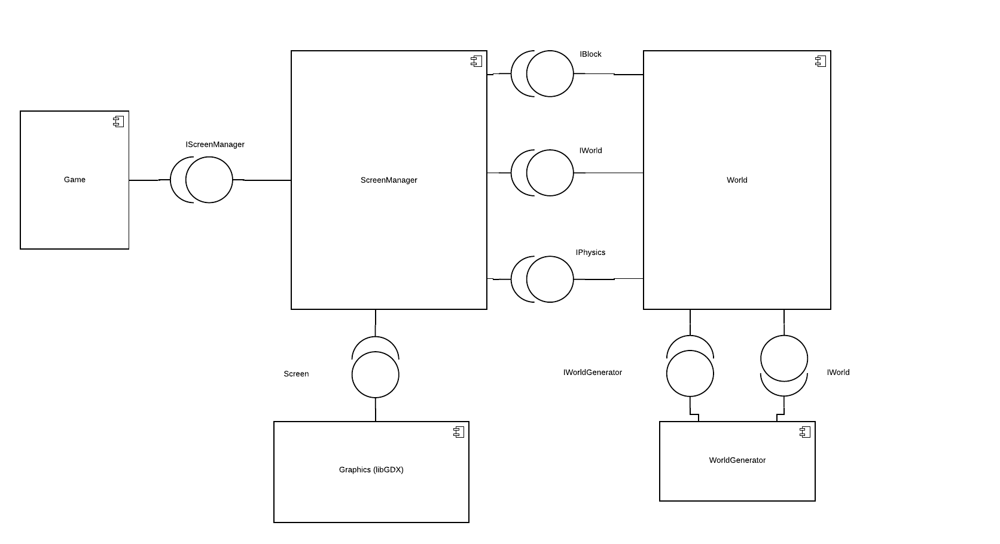
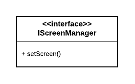
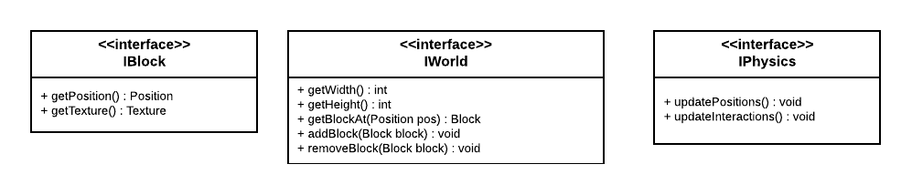
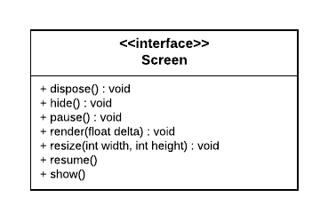
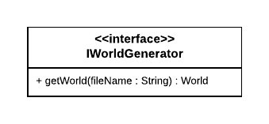

# Shroomite

# Descrição Resumida do Projeto/Jogo

Shroomite é um jogo 

# Equipe
- Vinícius de Oliveira Peixoto Rodrigues (245294)
- Gabriel Lucio de Araujo (172233)

# Vídeos do Projeto

## Vídeo da Prévia
[Link para o vídeo](https://drive.google.com/file/d/1eUm_f_Y6o4uk_PdVsud_TnUS8_cvRJDK/view?usp=sharing)

# Slides do Projeto

## Slides da Prévia
[Link para os slides](https://drive.google.com/file/d/1mho5to0dcvyb34_1SnJQUrX4QIbrx_Vs/view?usp=sharing)

# Documentação dos Componentes

# Diagramas

## Diagrama Geral do Projeto

Acima se encontra o diagrama geral da arquitetura de componentes do jogo.
Existem dois componentes principais: `ScreenManager` e `World`; o componente `ScreenManager` contém as 
diferentes telas do jogo (menu principal, jogo em andamento, editor de mapas, etc), enquanto o componente `World`
é responsável por guardar os objetos do jogo (blocos) e atualizar o estado do mundo (através do componente interno `Physics`).

## Componente `ScreenManager`

**Ficha Técnica**
item | detalhamento
----- | -----
Classes | `javasegfault.shroomite.GameScreen`
Autores | Vinícius e Gabriel
Interfaces requeridas | `IWorld`, `IBlock`, `IPhysics`, `IScreen`
Descrição | Responsável por inicializar um objeto `World` contendo os blocos do mundo e desenhá-lo na tela a cada frame, além de atualizar o estado do mundo usando a interface `IPhysics`.

item | detalhamento
----- | -----
Classes | `javasegfault.shroomite.MainMenuScreen`
Autores | Gabriel
Interfaces requeridas | `IScreen`
Descrição | Responsável por desenhar a tela do menu inicial e por fazer a troca para as telas `GameScreen` e `WorldEditorScreen` por meio dos botões na tela.

item | detalhamento
---- | ----
Classes | `javasegfault.shroomite.WorldEditorScreen`
Autores | Gabriel
Interfaces requeridas | `IScreen`
Descrição | Responsável por desenhar na tela o `WorldEditor`, que permite editar e carregar/salvar mapas em arquivos.

### Interfaces

Interfaces oferecidas por esse componente:

## Componente `World`

item | detalhamento
---- | ----
Classes | `javasegfault.shroomite.World`
Autores | Vinícius
Interfaces requeridas | `IWorldGenerator`
Descrição | Armazena os blocos do mundo em uma matriz e fornece a interface de acesso aos blocos (`IWorld`).

item | detalhamento
---- | ----
Classes | `javasegfault.shroomite.Physics`
Autores | Vinícius
Interfaces requeridas | Nenhuma
Descrição | Responsável por atualizar a posição/estado dos blocos do mundo.

item | detalhamento
---- | ----
Pacote | `javasegfault.shroomite.blocks`
Autores | Vinícius, Gabriel
Interfaces requeridas | Nenhuma
Descrição | Contém as classes dos blocos do mundo e providencia a interface `IBlock`.

### Interfaces

Interfaces oferecidas por esse componente:

## Componente Graphics

item | detalhamento
---- | ----
Pacote | `com.badlogic.libgdx`
Autor original | Mario Zechner (atualmente open source)
Interfaces requeridas | Nenhuma
Descrição | Framework gráfico baseado em OpenGL utilizado para renderizar o jogo.

### Interfaces

Interfaces oferecidas por esse componente:

## Componente `Game`

item | detalhamento
---- | ----
Classe | `javasegfault.shroomite.Shroomite`
Autores | Vinícius, Gabriel
Interfaces requeridas | `IScreenManager`
Descrição | Classe de entrada do jogo que é responsável por inicializar componentes da aplicação e invocar a tela inicial.

### Interfaces

Nenhuma interface oferecida.

## Componente WorldGenerator

item | detalhamento
---- | ----
Classe | `javasegfault.shroomite.WorldGenerator`
Autores | Vinícius, Gabriel
Interfaces requeridas | `IWorld`
Descrição | Responsável por ler um arquivo (gerado pelo `WorldEditor`) contendo o estado do mundo e montar um objeto `World`.

### Interfaces

Interfaces oferecidas por esse componente:

## Detalhamento das Interfaces

### Interface `<nome da interface>`

`<Resumo do papel da interface.>`

~~~
<Interface em Java.>
~~~

Método | Objetivo
-------| --------
`<id do método em Java>` | `<objetivo do método e descrição dos parâmetros>`

### Interface IScreenManager

Carrega um objeto `Screen` como a tela do jogo.

~~~java
public interface IScreenManager {
    public void setScreen(Screen screen);
}
~~~

Método | Objetivo
---- | ----
`setScreen` | Carrega um objeto `Screen` como a tela atual do jogo.

### Interface Screen

Interface para renderização de telas pelo libGDX.

~~~java
public interface Screen {
    public void dispose();
    public void hide();
    public void pause();
    public void render(float delta);
    public void resize(int width, int height);
    public void resume();
    public void show();
}
~~~

Documentação disponível [aqui](https://libgdx.badlogicgames.com/ci/nightlies/docs/api/com/badlogic/gdx/Screen.html).

### Interface IWorld

Permite acessar, adicionar e remover blocos em `World`.

~~~java
public interface IWorld {
    public int getWidth();
    public int getHeight();
    public Block getBlockAt(Position pos);
    public void addBlock(Block block);
    public void removeBlock(Block block);
}
~~~

Método | Objetivo
---- | ----
`getWidth` | Retorna o comprimento do mundo.
`getHeight` | Retorna a largura do mundo.
`getBlockAt` | Retorna o bloco na posição dada. Lança a exceção `PositionOutOfBoundsException` caso a posição esteja fora dos limites.
`addBlock` | Adiciona o bloco dado. Lança a exceção `InvalidBlockAddException` caso a posição do bloco já esteja ocupada por outro bloco.
`removeBlock` | Remove o bloco dado.

### Interface IBlockTexture

Permite acessar a textura de um bloco.

~~~java
public interface IBlockTexture {
    public Position getPosition();
    public Texture getTexture();
}
~~~

Método | Objetivo
---- | ----
`getPosition` | Retorna a posição do bloco.
`getTexture` | Retorna a textura do bloco.

### Interface IPhysics

Permite controlar a atualização do estado do mundo pela classe `Physics`.

~~~java
public interface IPhysics {
    void updatePositions();
    void updateInteractions();
}
~~~

Método | Objetivo
---- | ----
`updatePositions` | Atualiza a posição de cada bloco em `World`.
`updateInteractions` | Atualiza as interações de cada bloco em `World`.

### Interface IWorldGenerator

Monta um objeto `World` a partir de um arquivo (gerado pelo `WorldEditor` contendo o estado do mundo).

~~~java
public interface IWorldGenerator {
    World getWorld(String fileName);
}
~~~

Método | Interface
---- | ----
`getWorld` | Retorna o mundo gerado a partir do arquivo com nome `fileName`.

## Exemplo:

### Interface `ITableProducer`

Interface provida por qualquer fonte de dados que os forneça na forma de uma tabela.

~~~java
public interface ITableProducer {
  String[] requestAttributes();
  String[][] requestInstances();
}
~~~

Método | Objetivo
-------| --------
`requestAttributes` | Retorna um vetor com o nome de todos os atributos (colunas) da tabela.
`requestInstances` | Retorna uma matriz em que cada linha representa uma instância e cada coluna o valor do respectivo atributo (a ordem dos atributos é a mesma daquela fornecida por `requestAttributes`.

### Interface `IDataSetProperties`

Define o recurso (usualmente o caminho para um arquivo em disco) que é a fonte de dados.

~~~java
public interface IDataSetProperties {
  public String getDataSource();
  public void setDataSource(String dataSource);
}
~~~

Método | Objetivo
-------| --------
`getDataSource` | Retorna o caminho da fonte de dados.
`setDataSource` | Define o caminho da fonte de dados, informado através do parâmetro `dataSource`.

# Plano de Exceções

## Diagrama da hierarquia de exceções

## Descrição das classes de exceção

Classe                         | Descrição
------------------------------ | ---------
`InvalidGridDimensionsException` | Indica que não é possível criar uma grid para o mundo com as dimensões especificadas.
`InvalidPositionException`       | Indica que a posição de destino não é válida.
`PositionOutOfBoundsException`   | Indica que a posição está fora dos limites do mundo.
`InvalidBlockAddException`       | Indica que a posição em que o bloco seria adicionado não está vazia.
