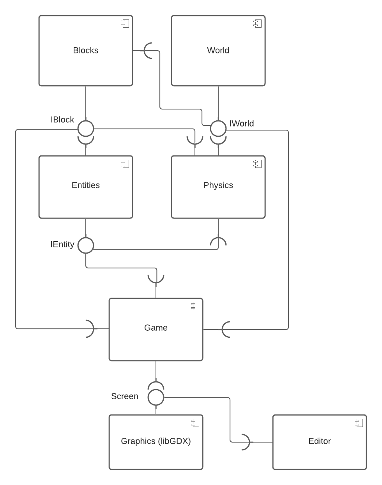
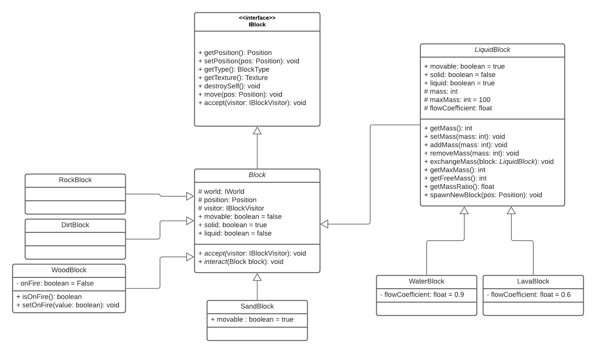
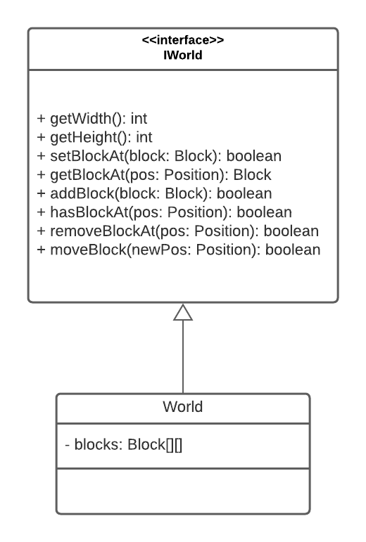
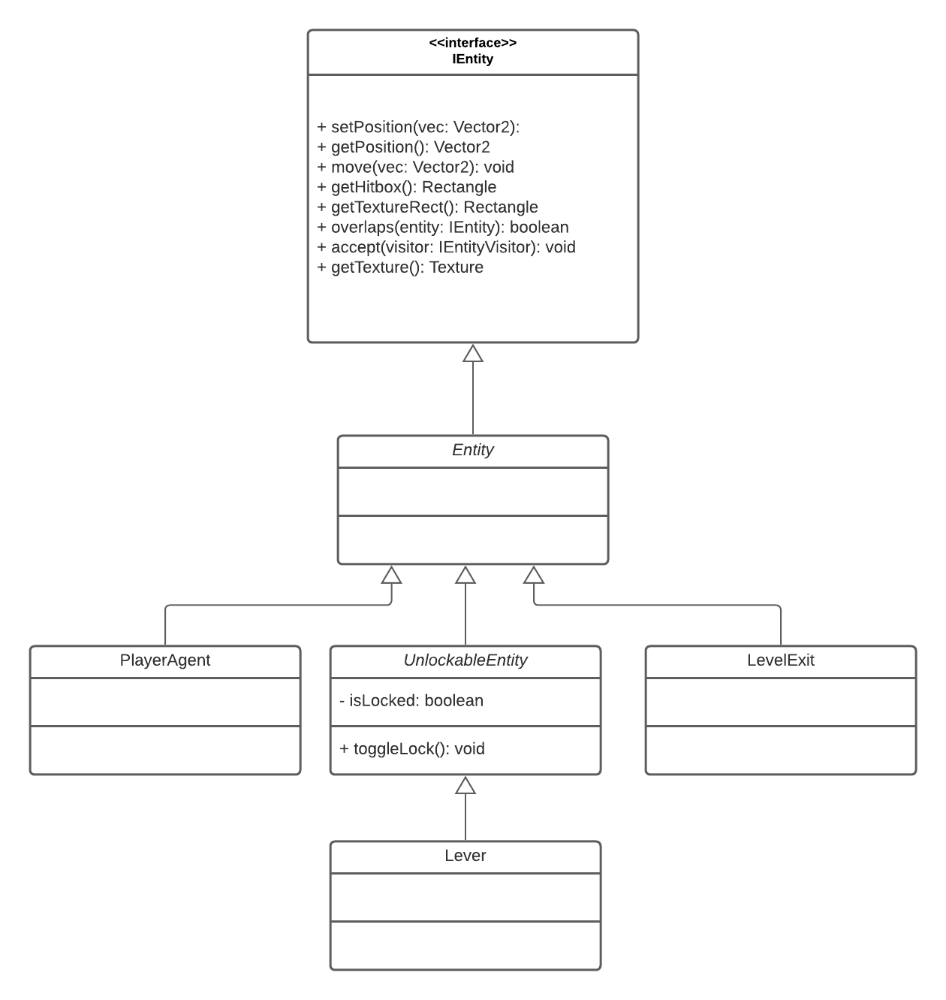
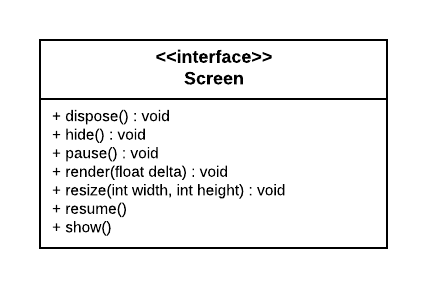
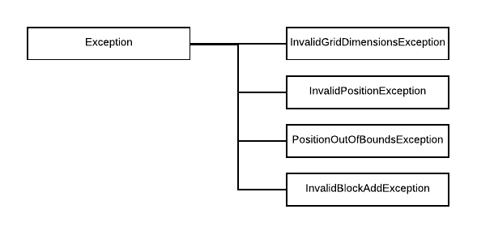

# Modelo de Apresentação do Projeto

# Estrutura de Arquivos e Pastas

A estrutura aqui apresentada é uma simplificação daquela proposta pelo [Cookiecutter Data Science](https://drivendata.github.io/cookiecutter-data-science/). Também será aceito que o projeto adote a estrutura completa do Cookiecutter Data Science e isso será considerado um diferencial. A estrutura geral é a seguinte e será detalhada a seguir:

~~~
├── README.md          <- apresentação do projeto
│
├── data               <- dados usados pelo jogo (se houver)
│
├── notebooks          <- Jupyter notebooks ou equivalentes
│
├── src                <- projeto em Java (preferencialmente projeto no Eclipse)
│   │
│   ├── src            <- arquivos-fonte do projeto (.java)
│   │
│   ├── bin            <- arquivos em bytecode (.class)
│   │
│   └── README.md      <- instruções básicas de instalação/execução
│
└── assets             <- mídias usadas no projeto
~~~

Na raiz deve haver um arquivo de nome `README.md` contendo a apresentação do projeto, como detalhado na seção seguinte.

## `data`

Arquivos de dados usados no projeto, quando isso ocorrer. Por exemplo, se o jogo lê mapas de labirintos que estão em arquivo-texto, coloque os arquivos aqui (mesmo que você mantenha uma cópia no diretório do código).

## `notebooks`

Testes ou prototipos relacionados ao projeto que tenham sido executados no Jupyter. Por exemplo, coloque aqui uma cópia dos testes feitos nas Exceptions.

## `src`

Projeto em Java, preferencialmente em Eclipse, incluindo todos os arquivos de dados e bibliotecas necessários para a sua execução. Dentro dessa pasta sugerimos que você mantenha uma estrutura equivalente ao Eclipse, com uma subpasta `src` onde estarão os fontes e outra subpasta `bin` onde estarão os bytecodes.

 Acrescente na raiz um arquivo `README.md` com as instruções básicas de instalação e execução.

## `assets`

Qualquer mídia usada no seu projeto: vídeo, imagens, animações, slides etc. Coloque os arquivos aqui (mesmo que você mantenha uma cópia no diretório do código).

# Projeto: `Shroomite`

# Descrição Resumida do Projeto/Jogo

Shroomite é um jogo sandbox/roguelike que toma inspiração de títulos como Minecraft, Terraria, Hollow Knight e Noita. O jogo se passa em salas contendo um espaço celular (_grid_) onde residem blocos (que ocupam as células do mundo).
Há também entidades que interagem com os blocos e entre si mesmas, não estando presas ao espaço celular e podendo mover-se livremente.

Cada sala contém uma porta (inicialmente trancada) e um conjunto de alavancas que devem ser desbloqueadas para destrancar a porta.
A principal entidade do jogo é o Jogador, que é controlado pelo usuário e se move pelas salas com o objetivo de destrancar a saída após interagir com todas as alavanças da sala, evitando perder pontos de vida ao interagir com os blocos e entidades da sala.
O jogo também possui um editor de salas que permite editar mapas para criar salas customizadas.

# Equipe
* `<nome completo>` - `<RA>`

# Vídeos do Projeto

## Vídeo da Prévia
> <Coloque um link para o vídeo da prévia do projeto.>

## Vídeo do Jogo
> <Coloque um link para o vídeo em que é demonstrada a versão final do jogo. Esse vídeo deve ter em torno de 5 minutos. Este vídeo não apresenta slides, nem substitui a apresentação final do projeto, que será feita por conferência. Ele mostra apenas o jogo em funcionamento.>

[Link](https://drive.google.com/file/d/1kvasaeyAL6Wu9tF9zHQYZ0WG8isFhKqq/view?usp=sharing)

# Slides do Projeto

## Slides da Prévia
`<Coloque um link para os slides da prévia do projeto.>`

## Slides da Apresentação Final
`<Coloque um link para os slides da apresentação final do projeto.>`

## Relatório de Evolução

> <Relatório de evolução, descrevendo as evoluções do design do projeto, dificuldades enfrentadas, mudanças de rumo, melhorias e lições aprendidas. Referências aos diagramas e recortes de mudanças são bem-vindos.>

# Destaques de Código

> <Escolha trechos relevantes e/ou de destaque do seu código. Apresente um recorte (você pode usar reticências para remover partes menos importantes). Veja como foi usado o highlight de Java para o código.>

~~~java
// Recorte do seu código
public void algoInteressante(…) {
   …
   trechoInteressante = 100;
}
~~~

# Destaques de Pattern
`<Destaque de patterns adotados pela equipe. Sugestão de estrutura:>`

## Diagrama do Pattern
`<Diagrama do pattern dentro do contexto da aplicação.>`

## Código do Pattern
~~~java
// Recorte do código do pattern seguindo as mesmas diretrizes de outros destaques
public void algoInteressante(…) {
   …
   trechoInteressante = 100;
}
~~~

> <Explicação de como o pattern foi adotado e quais suas vantagens, referenciando o diagrama.>

# Conclusões e Trabalhos Futuros

> <Apresente aqui as conclusões do projeto e propostas de trabalho futuro. Esta é a oportunidade em que você pode indicar melhorias no projeto a partir de lições aprendidas e conhecimentos adquiridos durante a realização do projeto, mas que não puderam ser implementadas por questões de tempo. Por exemplo, há design patterns aprendidos no final do curso que provavelmente não puderam ser implementados no jogo -- este é o espaço onde você pode apresentar como aplicaria o pattern no futuro para melhorar o jogo.>

# Documentação dos Componentes

# Diagramas

## Diagrama Geral do Projeto (Diagrama de Componentes)

A princípio, a arquitetura do jogo pode ser dividida em dois "blocos": o `Editor` e o `Game`.

O `Editor`, apesar de fornecer ferramentas para criação/edição/serialização de mapas, é completamente independente do funcionamento interno dos componentes relacionados ao jogo em si, precisando somente de informações sobre os tipos de `Block` e `Entity` existentes.

Já o bloco `Game` encapsula os componentes `World + Blocks`, `Entities`, `Physics` e `Game`, sendo responsável pela execução do jogo em si (com o jogador controlando um personagem).

## Componente Blocks

O componente `Blocks` (contido no pacote `com.javasegfault.shroomite.blocks`) encapsula as classes que definem os blocos que ocupam o espaço celular do jogo.
Todos os blocos derivam da classe abstrata `com.javasegfault.shroomite.blocks.Block`; além disso, o componente fornece a interface `IBlock` que permite a interação com os blocos.

**Ficha Técnica**
item | detalhamento
----- | -----
Pacote  | `com.javasegfault.shroomite.blocks`
Classes | `Block`   `DirtBlock`   `RockBlock`   `SandBlock`   `WoodBlock`   `LiquidBlock`   `WaterBlock`   `LavaBlock`
Autores | Vinícius, Gabriel
Interfaces | `IBlock`

### Interfaces

Interfaces associadas a esse componente:

## Componente World

O componente `World` (contido no pacote `com.javasegfault.shroomite`) é responsável por armazenar os objetos `Block` e fornecer uma interface (`IWorld`) padrão que permite acessar elementos a partir de um objeto `com.javasegfault.util.Position` (que representa as coordenadas `x` e `y` de um bloco no espaço celular).

A implementação escolhida aqui usa uma matriz de duas dimensões como estrutura de dados que armazena os blocos.

**Ficha Técnica**
item | detalhamento
----- | -----
Pacote  | `com.javasegfault.shroomite`
Classes | `World`
Autores | Vinícius, Gabriel
Interfaces | `IWorld`

### Interfaces

Interfaces associadas a esse componente:

## Componente Entities

O componente `Entities` (contido no pacote `com.javasegfault.shroomite.entities`) encapsula os elementos não-celulares do jogo (PlayerAgent, LevelExit e Lever). As características mais importantes dos objetos `Entity` são:

1. Possuem hitboxes e retângulos de textura
2. Suas posições são definidas por objetos `Vector2`, representando vetores 2D (a posição de um `Entity` é a posição do ponto inferior esquerdo do seu retângulo de hitbox)

O componente fornece também a interface `IEntity` que possibilita controlar objetos `Entity`.

**Ficha Técnica**
item | detalhamento
----- | -----
Pacote  | `com.javasegfault.shroomite.entities`
Classes | `PlayerAgent`, `PlayerBlockVisitor`, `PlayerEntityVisitor`, `StatusEffect`, `StatusEffectManager`   `LevelExit`   `UnlockableEntity`, `Lever`
Autores | Vinícius
Interfaces | `IEntity`, `IEntityVisitor`

### Interfaces

Interfaces associadas a esse componente:

## Componente Physics

O componente `Physics` é responsável por:

1. Atualizar as posições dos blocos (fazer blocos sólidos caírem, blocos líquidos fluírem, etc)
2. Atualizar as posições das entidades (fazê-las se movimentarem, caírem sob a ação da gravidade, etc)
3. Resolver colisões (especialmente do PlayerAgent com blocos sólidos)
4. Atualizar as interações entre todos os elementos entre si (e.g. causar dano de fogo no PlayerAgent ao interagir com um bloco de lava, fazer um bloco de água se tornar um bloco de pedra ao interagir com a lava, etc)

Desse modo, o componente `Physics` faz uso da maioria das interfaces fornecidas pelos outros componentes.

**Ficha Técnica**
item | detalhamento
----- | -----
Pacote  | `com.javasegfault.shroomite.physics`
Classes | `Physics`, `UpdateBlockPositionVisitor`
Autores | Vinícius
Interfaces | -

### Interfaces

Esse componente não fornece interfaces.

## Componente Screen

O componente `Graphics`, que encapsula uma série de classes do framework libGDX, é responsável por imprimir texturas na tela. A comunicação com esse componente é feita por meio da interface `Screen`.

**Ficha Técnica**
item | detalhamento
----- | -----
Pacote  | `com.badlogic.gdx`
Classes | `ScreenAdapter`
Autores | - 
[Interfaces](Interfaces) | `Screen`

### Interfaces

A documentação da interface `Screen` pode ser encontrada
[aqui](https://libgdx.badlogicgames.com/ci/nightlies/docs/api/com/badlogic/gdx/Screen.html).

## Componente Game

O componente `Game` é responsável por inicializar, configurar, chamar a atualização e renderizar na tela todos os outros componentes.

**Ficha Técnica**
item | detalhamento
----- | -----
Pacote  | `com.javasegfault.shroomite`
Classes | `GameScreen`
Autores | Vinícius
Interfaces | -

### Interfaces

Esse componente não fornece interfaces.

## Detalhamento das Interfaces

### Interface `<nome da interface>`

`<Resumo do papel da interface.>`

~~~
<Interface em Java.>
~~~

Método | Objetivo
-------| --------
`<id do método em Java>` | `<objetivo do método e descrição dos parâmetros>`

## Exemplo:

### Interface `IEntity`

Interface provida por objetos `Entity`, permitindo a sua manipulação.

~~~java
public interface IEntity {
    public void setPosition(Vector2 vec);
    public Vector2 getPosition();
    public Rectangle getHitbox();
    public Rectangle getTextureRect();
    public boolean overlaps(IEntity entity);
    public void accept(IEntityVisitor visitor);
    public Texture getTexture();
}
~~~

Método | Objetivo
-------| --------
`setPosition` | Define a posição da entidade (o canto inferior esquerdo da sua hitbox).
`getPosition` | Retorna a posição da entidade.
`getHitbox`   | Retorna o Rectangle que representa a hitbox da entidade.
`getTextureRect` | Retorna o Rectangle que representa a região em que a textura da entidade deve ser desenhada.
`overlaps`    | Verifica se há sobreposição entre as hitboxes das duas entidades.
`accept`      | Aceita um IEntityVisitor (chamando o método adequado do Visitor).
`getTexture`  | Retorna a Texture da entidade.

### Interface `IBlock`

Interface provida por objetos `Block`, permitindo a sua manipulação.

~~~java
public interface IBlock {
    Position getPosition();
    void setPosition(Position position);
    BlockType getType();
    Texture getTexture();
    void destroySelf();
    void move(Position pos);
    void accept(IBlockVisitor visitor);
}
~~~

Método | Objetivo
-------| --------
`getPosition`   | Retorna a posição do bloco no espaço celular.
`setPosition`   | Define a posição do bloco no espaço celular.
`getTexture`    | Retorna a textura do bloco.
`destroySelf`   | Remove o bloco do mundo.
`move`          | Pede ao componente `World` a mudança de posição do bloco.
`accept`        | Aceita um IBlockVisitor (chamando a função adequada do Visitor).

### Interface `IWorld`

Interface fornecida pelo componente `World`, permitindo o acesso a blocos.

~~~java

public interface IWorld {
    int getWidth();
    int getHeight();
    boolean setBlock(Block block);
    boolean setBlockAt(Position position, Block block);
    boolean addBlock(Block block);
    boolean addBlockAt(Position position, Block block);
    Block getBlockAt(Position position);
    boolean hasBlockAt(Position position);
    boolean removeBlockAt(Position position);
    boolean moveBlock(Block block, Position newPosition);
~~~

Método | Objetivo
-------| --------
`getWidth`          | Retorna quantos blocos de comprimento o espaço celular possui.
`getHeight`         | Retorna quantos blocos de altura o espaço celular possui.
`setBlock`          | Adiciona um bloco, sem checar se a posição do bloco já está ocupada. Retorna falso se a posição do bloco for inválida (fora dos limites).
`setBlockAt`        | Adiciona um bloco na posição dada, sem checar se a posição já está ocupada. Retorna falso de a posição do bloco for inválida (fora dos limites).
`addBlock`          | Adiciona um bloco se a posição estiver livre. Retorna falso se a posição for inválida ou já estiver ocupada.
`addBlockAt`        | Adiciona um bloco na posição dada caso ela esteja livre. Retorna falso se a posição for inválida ou já estiver ocupada.
`getBlockAt`        | Retorna o bloco na posição dada, ou `null` caso ela seja inválida ou esteja vazia.
`hasBlockAt`        | Verifica se há um bloco na posição dada. Retorna falso caso a posição seja inválida.
`removeBlockAt`     | Remove um bloco na posição dada. Retorna falso caso a posição seja inválida ou esteja vazia.
`moveBlock`         | Move um bloco para a posição dada caso ela esteja vazia e seja válida. Retorna falso caso não seja possível adicionar.

# Plano de Exceções

## Diagrama da hierarquia de exceções
`<Elabore um diagrama com a hierarquia de exceções como detalhado abaixo>`

## Descrição das classes de exceção

`<Monte uma tabela descritiva seguindo o exemplo>:`

Classe | Descrição
----- | -----
DivisaoInvalida | Engloba todas as exceções de divisões não aceitas.
DivisaoInutil | Indica que a divisão por 1 é inútil.
DivisaoNaoInteira [|](|) Indica uma divisão não inteira.
