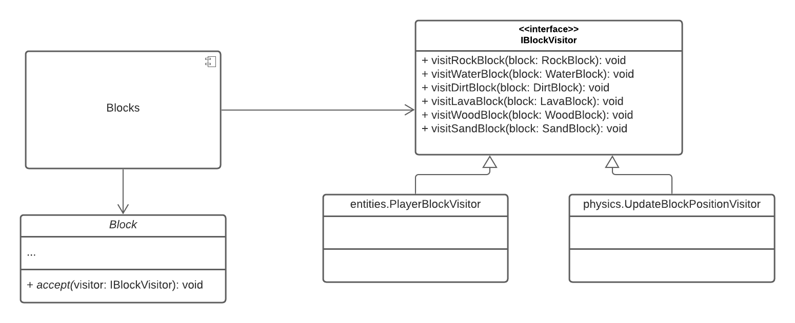

# Projeto: `Shroomite`

# Descrição Resumida do Projeto/Jogo

Shroomite é um jogo sandbox/roguelike que toma inspiração de títulos como Minecraft, Terraria, Hollow Knight e Noita. O jogo se passa em salas contendo um espaço celular (_grid_) onde residem blocos (que ocupam as células do mundo).
Há também entidades que interagem com os blocos e entre si mesmas, não estando presas ao espaço celular e podendo mover-se livremente.

Cada sala contém uma porta (inicialmente trancada) e um conjunto de alavancas que devem ser desbloqueadas para destrancar a porta.
A principal entidade do jogo é o Jogador, que é controlado pelo usuário e se move pelas salas com o objetivo de destrancar a saída após interagir com todas as alavanças da sala, evitando perder pontos de vida ao interagir com os blocos e entidades da sala.
O jogo também possui um editor de salas que permite editar mapas para criar salas customizadas.

## Agradecimentos

Gostaríamos de agradecer a toda a comunidade do framework [libGDX](https://libgdx.com/), responsável por manter e documentar o framework gráfico que usamos nesse projeto. 

Também queremos agradecer o usuário [0x72](https://0x72.itch.io/) por disponibilizar gratuitamente o asset pack [DungeonTilesetII](https://0x72.itch.io/dungeontileset-ii).

# Equipe
- Vinícius de Oliveira Peixoto Rodrigues (245294)
- Gabriel Lucio de Araujo (172233)

# Vídeos do Projeto

## Vídeo da Prévia
[Link para o vídeo](https://drive.google.com/file/d/1eUm_f_Y6o4uk_PdVsud_TnUS8_cvRJDK/view?usp=sharing)

## Vídeo do Jogo
[Link para o vídeo](https://drive.google.com/file/d/1kvasaeyAL6Wu9tF9zHQYZ0WG8isFhKqq/view?usp=sharing)

# Slides do Projeto

## Slides da Prévia
[Link para os slides](https://drive.google.com/file/d/1mho5to0dcvyb34_1SnJQUrX4QIbrx_Vs/view?usp=sharing)

## Slides da Apresentação Final
[Link para os slides](https://docs.google.com/presentation/d/1sFedvZxpM2xsTM8zwWL0CVoQeUwDSvinKGh3GqLZrtg/edit)

# Estrutura de Arquivos e Pastas

~~~
├── README.md                   <- apresentação do projeto
│
├── data                        <- dados usados pelo jogo (mapas)
│
├── src
│   │
│   ├── build.gradle
│   ├── core                    <- código fonte do jogo em si
│   │   ├── assets
│   │   ├── build
│   │   ├── build.gradle
│   │   └── src
│   ├── desktop                 <- código que controla a execução do jogo no ambiente desktop
│   │   ├── build                  (tamanho da janela, resolução, framerate, etc)
│   │   ├── build.gradle
│   │   └── src
│   ├── gradle
│   │   └── wrapper
│   ├── gradle.properties
│   ├── gradlew
│   ├── gradlew.bat
│   └── settings.gradle
│
├── reports                     <- imagens utilizadas no relatório/documentação do README.md
│
└── assets                      <- mídias usadas no projeto (sprites)
~~~

A estrutura de pastas dentro de `src/` é gerada automaticamente pelo wizard de configuração do framework gráfico que usamos e faz uso da ferramenta [Gradle](https://gradle.org/) para buildar o projeto.
Os binários se encontram dentro das pastas `build` em `src/core` e `src/desktop`.

## Relatório de Evolução

Nós começamos com a ideia simples de ter um jogo inspirado em Terraria que tivesse vários tipos de blocos que interagem entre si e se comportam como autômatos celulares, e ao longo do desenvolvimento nós fomos adicionando coisas incrementalmente em cima dessa ideia.
Acreditamos que esse processo incremental acabou gerando várias dificuldades que nos levaram a não ter tempo de adicionar algumas coisas que queríamos (como NPCs e um sistema de inventário pro player).
O processo todo nos ensinou a importância de se fazer um plano de projeto cuidadoso com design de arquitetura e componentes bem definidos antes de se começar a escrever o código em si.

Contudo, ao longo do caminho nós implementamos várias melhorias no projeto. Inicialmente não tínhamos interfaces bem definidas e isso estava tornando difícil a implementação da física do jogo. Eventualmente nós criamos a separação entre os componentes de blocos e o componente que armazena/fornece acesso ao espaço celular de blocos, e isso facilitou significativamente o desenvolvimento.

Também tínhamos problemas relacionados a fazer muitas checagens de tipo + typecasts e encontramos uma solução envolvendo o design pattern de Visitor, que tornou o código todo um pouco mais geral e diminuiu o acoplamento. 

# Destaques de Código

## Montagem do componente `Game`
~~~java
    public GameScreen(final Shroomite game, final String worldName) {
        ...

        // libGDX looks for files in the core/assets/ folder
        this.worldName = worldName;
        WorldGenerator worldGenerator = new WorldGenerator("worlds/" + worldName);
        world = worldGenerator.getWorld();
        player = worldGenerator.getPlayer();
        unlockableEntities = worldGenerator.getUnlockableEntities();
        levelExit = worldGenerator.getLevelExit();

        physics = new Physics(world);
        
        ...
    }
~~~

Esse recorte mostra como o componente `Game` é "montado" a partir dos outros componentes: a classe `WorldGenerator` lê os arquivos `.grid` contendo a "serialização" dos mapas que foram feitos no editor e gera os diversos componentes a serem usados pelo jogo (o espaço celular `World`, as alavancas usadas pra desbloquear a saída, a saída do nível em si, o `Player` e o componente que implementa a física do jogo).

## Controle de estado do jogo

O fragmento de código abaixo, presente no componente `Game` (`com.javasegfault.shroomite.GameScreen`) ilustra basicamente a lógica inteira de atualização do estado do jogo realizada a cada frame:

~~~java
    @Override
    public void render(float delta) {
        // processes player input
        handleInput();
        
        // updates the blocks (every 17ms, i.e. 60 times per second)
        if (TimeUtils.timeSinceMillis(lastPhysicsCallTime) > 17) {
            physics.updatePositions();
            physics.updateInteractions();
            lastPhysicsCallTime = TimeUtils.millis();
        }

        physics.updatePlayer(player, delta);

        // makes the player interact with levers
        for (UnlockableEntity entity : unlockableEntities) {
            if (player.overlaps(entity)) {
                player.interact(entity);
            }
        }

        // checks if all the levers (and thus the level exit) are unlocked
        boolean isDoorUnlocked = true;
        for (UnlockableEntity entity : unlockableEntities) {
            if (entity.isLocked()) {
                isDoorUnlocked = false;
                break;
            }
        }

        // checks if the player can exit and is colliding with the exit
        if (isDoorUnlocked && player.overlaps(levelExit)) {
            if (gameState != GameState.LEVEL_COMPLETE) {
                gameState = GameState.LEVEL_COMPLETE;
            }
        }

        // game over if the player health drops below 0
        if (player.getHp() < 0) {
            if (gameState != GameState.GAME_OVER) {
                gameState = GameState.GAME_OVER;
            }
        }
    }
~~~

# Destaques de Pattern

## Visitor

### Diagrama do Pattern

### Código do Pattern

~~~java
public interface IBlockVisitor {
    void visitRockBlock(RockBlock block);
    void visitWaterBlock(WaterBlock block);
    void visitDirtBlock(DirtBlock block);
    void visitLavaBlock(LavaBlock block);
    void visitWoodBlock(WoodBlock block);
    void visitSandBlock(SandBlock block);
}
~~~

~~~java
public class UpdateBlockPositionVisitor implements IBlockVisitor {
    private void updateMovableBlock(Block block) {
        ...
    }

    private void updateSandBlock(SandBlock block) {
        ...
    }

    private void updateLiquidBlock(LiquidBlock block) {
        ...
    }

    public void visitWaterBlock(WaterBlock block) {
        updateLiquidBlock(block);
    }

    public void visitLavaBlock(LavaBlock block) {
        updateLiquidBlock(block);
    }

    public void visitSandBlock(SandBlock block) {
        updateSandBlock(block);
    }
    
    ...
}
~~~

Implementamos o design pattern [Visitor](https://refactoring.guru/design-patterns/visitor) no componente `Physics` para separar os algoritmos que atualizam o estado dos blocos (simulação de areia caindo, simulação de líquidos, etc) dos objetos em si. O componente `Physics` recebe por meio da interface `IWorld` os objetos `Block` que se encontram em uma dada posição, mas ele precisa saber o tipo dos blocos para decidir como atualizar os seus estados.
Em vez de guardar um `enum` com os tipos de cada bloco e fazer um grande `switch/case` seguido de vários typecasts (de `Block` para as classes herdeiras), decidimos implementar esse design pattern, onde o bloco em si é responsável por chamar a função adequada da interface `Visitor`. Por exemplo, para o bloco `WaterBlock`:

~~~java
@Override
public void accept(IBlockVisitor visitor) {
    visitor.visitWaterBlock(this);
}
~~~

# Conclusões e Trabalhos Futuros

Uma das melhorias que nós tínhamos em mente desde o começo do projeto era implementar um sistema de inventário para o jogador. Com a arquitetura que desenvolvemos até agora isso poderia ser implementado facilmente desde que se fizesse uma separação entre o armazenamento de blocos e de outros itens que não são blocos (como uma picareta, poções de cura, etc).

Outra melhoria seria a implementação de NPCs, que também seria relativamente simples (visto que é possível extrair facilmente uma interface `IAgent` da classe `PlayerAgent` que expõe as funções básicas que um agente do jogo precisa ter, como a habilidade de se mover, interagir com blocos e outras entidades, etc).

# Documentação dos Componentes

# Diagramas

## Diagrama Geral do Projeto (Diagrama de Componentes)

A princípio, a arquitetura do jogo pode ser dividida em dois "blocos": o `Editor` e o `Game`.

O `Editor`, apesar de fornecer ferramentas para criação/edição/serialização de mapas, é completamente independente do funcionamento interno dos componentes relacionados ao jogo em si, precisando somente de informações sobre os tipos de `Block` e `Entity` existentes.

Já o bloco `Game` encapsula os componentes `World + Blocks`, `Entities`, `Physics` e `Game`, sendo responsável pela execução do jogo em si (com o jogador controlando um personagem).

## Componente Blocks

O componente `Blocks` (contido no pacote `com.javasegfault.shroomite.blocks`) encapsula as classes que definem os blocos que ocupam o espaço celular do jogo.
Todos os blocos derivam da classe abstrata `com.javasegfault.shroomite.blocks.Block`; além disso, o componente fornece a interface `IBlock` que permite a interação com os blocos.

**Ficha Técnica**
item | detalhamento
----- | -----
Pacote  | `com.javasegfault.shroomite.blocks`
Classes | `Block`   `DirtBlock`   `RockBlock`   `SandBlock`   `WoodBlock`   `LiquidBlock`   `WaterBlock`   `LavaBlock`
Autores | Vinícius, Gabriel
Interfaces | `IBlock`

### Interfaces

Interfaces associadas a esse componente:

## Componente World

O componente `World` (contido no pacote `com.javasegfault.shroomite`) é responsável por armazenar os objetos `Block` e fornecer uma interface (`IWorld`) padrão que permite acessar elementos a partir de um objeto `com.javasegfault.util.Position` (que representa as coordenadas `x` e `y` de um bloco no espaço celular).

A implementação escolhida aqui usa uma matriz de duas dimensões como estrutura de dados que armazena os blocos.

**Ficha Técnica**
item | detalhamento
----- | -----
Pacote  | `com.javasegfault.shroomite`
Classes | `World`
Autores | Vinícius, Gabriel
Interfaces | `IWorld`

### Interfaces

Interfaces associadas a esse componente:

## Componente Entities

O componente `Entities` (contido no pacote `com.javasegfault.shroomite.entities`) encapsula os elementos não-celulares do jogo (PlayerAgent, LevelExit e Lever). As características mais importantes dos objetos `Entity` são:

1. Possuem hitboxes e retângulos de textura
2. Suas posições são definidas por objetos `Vector2`, representando vetores 2D (a posição de um `Entity` é a posição do ponto inferior esquerdo do seu retângulo de hitbox)

O componente fornece também a interface `IEntity` que possibilita controlar objetos `Entity`.

**Ficha Técnica**
item | detalhamento
----- | -----
Pacote  | `com.javasegfault.shroomite.entities`
Classes | `PlayerAgent`, `PlayerBlockVisitor`, `PlayerEntityVisitor`, `StatusEffect`, `StatusEffectManager`   `LevelExit`   `UnlockableEntity`, `Lever`
Autores | Vinícius
Interfaces | `IEntity`, `IEntityVisitor`

### Interfaces

Interfaces associadas a esse componente:

## Componente Physics

O componente `Physics` é responsável por:

1. Atualizar as posições dos blocos (fazer blocos sólidos caírem, blocos líquidos fluírem, etc)
2. Atualizar as posições das entidades (fazê-las se movimentarem, caírem sob a ação da gravidade, etc)
3. Resolver colisões (especialmente do PlayerAgent com blocos sólidos)
4. Atualizar as interações entre todos os elementos entre si (e.g. causar dano de fogo no PlayerAgent ao interagir com um bloco de lava, fazer um bloco de água se tornar um bloco de pedra ao interagir com a lava, etc)

Desse modo, o componente `Physics` faz uso da maioria das interfaces fornecidas pelos outros componentes.

**Ficha Técnica**
item | detalhamento
----- | -----
Pacote  | `com.javasegfault.shroomite.physics`
Classes | `Physics`, `UpdateBlockPositionVisitor`
Autores | Vinícius
Interfaces | -

### Interfaces

Esse componente não fornece interfaces.

## Componente Screen

O componente `Graphics`, que encapsula uma série de classes do framework libGDX, é responsável por imprimir texturas na tela. A comunicação com esse componente é feita por meio da interface `Screen`.

**Ficha Técnica**
item | detalhamento
----- | -----
Pacote  | `com.badlogic.gdx`
Classes | `ScreenAdapter`
Autores | - 
Interfaces | `Screen`

### Interfaces

A documentação da interface `Screen` pode ser encontrada
[aqui](https://libgdx.badlogicgames.com/ci/nightlies/docs/api/com/badlogic/gdx/Screen.html).

## Componente Game

O componente `Game` é responsável por inicializar, configurar, chamar a atualização e renderizar na tela todos os outros componentes.

**Ficha Técnica**
item | detalhamento
----- | -----
Pacote  | `com.javasegfault.shroomite`
Classes | `GameScreen`
Autores | Vinícius
Interfaces | -

### Interfaces

Esse componente não fornece interfaces.

## Detalhamento das Interfaces

### Interface `<nome da interface>`

`<Resumo do papel da interface.>`

~~~
<Interface em Java.>
~~~

Método | Objetivo
-------| --------
`<id do método em Java>` | `<objetivo do método e descrição dos parâmetros>`

## Exemplo:

### Interface `IEntity`

Interface provida por objetos `Entity`, permitindo a sua manipulação.

~~~java
public interface IEntity {
    public void setPosition(Vector2 vec);
    public Vector2 getPosition();
    public Rectangle getHitbox();
    public Rectangle getTextureRect();
    public boolean overlaps(IEntity entity);
    public void accept(IEntityVisitor visitor);
    public Texture getTexture();
}
~~~

Método | Objetivo
-------| --------
`setPosition` | Define a posição da entidade (o canto inferior esquerdo da sua hitbox).
`getPosition` | Retorna a posição da entidade.
`getHitbox`   | Retorna o Rectangle que representa a hitbox da entidade.
`getTextureRect` | Retorna o Rectangle que representa a região em que a textura da entidade deve ser desenhada.
`overlaps`    | Verifica se há sobreposição entre as hitboxes das duas entidades.
`accept`      | Aceita um IEntityVisitor (chamando o método adequado do Visitor).
`getTexture`  | Retorna a Texture da entidade.

### Interface `IBlock`

Interface provida por objetos `Block`, permitindo a sua manipulação.

~~~java
public interface IBlock {
    Position getPosition();
    void setPosition(Position position);
    BlockType getType();
    Texture getTexture();
    void destroySelf();
    void move(Position pos);
    void accept(IBlockVisitor visitor);
}
~~~

Método | Objetivo
-------| --------
`getPosition`   | Retorna a posição do bloco no espaço celular.
`setPosition`   | Define a posição do bloco no espaço celular.
`getTexture`    | Retorna a textura do bloco.
`destroySelf`   | Remove o bloco do mundo.
`move`          | Pede ao componente `World` a mudança de posição do bloco.
`accept`        | Aceita um IBlockVisitor (chamando a função adequada do Visitor).

### Interface `IWorld`

Interface fornecida pelo componente `World`, permitindo o acesso a blocos.

~~~java

public interface IWorld {
    int getWidth();
    int getHeight();
    boolean setBlock(Block block);
    boolean setBlockAt(Position position, Block block);
    boolean addBlock(Block block);
    boolean addBlockAt(Position position, Block block);
    Block getBlockAt(Position position);
    boolean hasBlockAt(Position position);
    boolean removeBlockAt(Position position);
    boolean moveBlock(Block block, Position newPosition);
~~~

Método | Objetivo
-------| --------
`getWidth`          | Retorna quantos blocos de comprimento o espaço celular possui.
`getHeight`         | Retorna quantos blocos de altura o espaço celular possui.
`setBlock`          | Adiciona um bloco, sem checar se a posição do bloco já está ocupada. Retorna falso se a posição do bloco for inválida (fora dos limites).
`setBlockAt`        | Adiciona um bloco na posição dada, sem checar se a posição já está ocupada. Retorna falso de a posição do bloco for inválida (fora dos limites).
`addBlock`          | Adiciona um bloco se a posição estiver livre. Retorna falso se a posição for inválida ou já estiver ocupada.
`addBlockAt`        | Adiciona um bloco na posição dada caso ela esteja livre. Retorna falso se a posição for inválida ou já estiver ocupada.
`getBlockAt`        | Retorna o bloco na posição dada, ou `null` caso ela seja inválida ou esteja vazia.
`hasBlockAt`        | Verifica se há um bloco na posição dada. Retorna falso caso a posição seja inválida.
`removeBlockAt`     | Remove um bloco na posição dada. Retorna falso caso a posição seja inválida ou esteja vazia.
`moveBlock`         | Move um bloco para a posição dada caso ela esteja vazia e seja válida. Retorna falso caso não seja possível adicionar.
